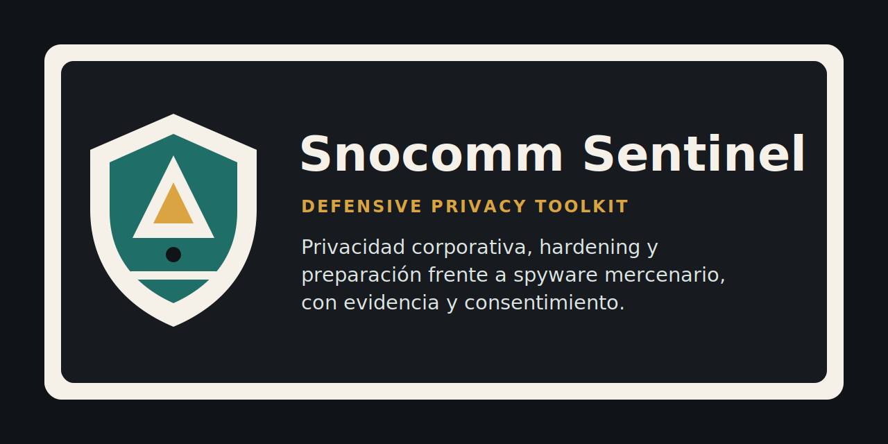

# Snocomm Sentinel



Privacidad corporativa, preparación frente a spyware mercenario y auditoría de exposición del sistema.

## Resumen ejecutivo

Snocomm Sentinel es un toolkit open source defensivo para organizaciones que necesitan evaluar exposición frente a spyware mercenario, shells ofensivas públicas, mala configuración corporativa y fingerprinting excesivo. Su propósito es ayudar a equipos de TI, seguridad, dirección y área legal a convertir señales técnicas dispersas en reportes comprensibles, recomendaciones de hardening y flujos de respuesta proporcionados.

El proyecto se centra en auditoría local no invasiva, análisis de superficie de ataque, reducción de exposición, preparación forense consensual y documentación ejecutiva. No promete eliminar Pegasus, no reemplaza análisis forense profesional y no modifica archivos del sistema operativo.

## Qué hace

- Ejecuta auditorías locales no invasivas en equipos autorizados.
- Revisa exposición del sistema operativo, servicios de sharing, perfiles de configuración, posible enrolamiento MDM y postura básica de hardening.
- Registra el build number como parte del fingerprint del sistema, solo en modo lectura y sin parchear el sistema.
- Genera reportes JSON y Markdown para equipos técnicos y dirección corporativa.
- Entrega recomendaciones de hardening, minimización de fingerprinting y reducción de superficie de ataque.
- Orienta la integración documental con MVT de Amnesty International.
- Detecta presencia local de rutas o nombres compatibles con herramientas públicas llamadas “Pegasus” o “Nebrix/Pegasus”, sin ejecutarlas.
- Distingue entre Pegasus de NSO Group y herramientas públicas de terceros con nombre similar.
- Recomienda evaluar Lockdown Mode cuando el perfil de riesgo lo justifica.
- Ayuda a revisar postura corporativa de privacidad, gobernanza y manejo de evidencia.

## Qué no hace

- No hackea, no explota vulnerabilidades y no ejecuta payloads.
- No elimina Pegasus mágicamente ni promete detección absoluta de spyware mercenario.
- No reemplaza análisis forense profesional.
- No reemplaza MVT de Amnesty International.
- No modifica archivos del sistema operativo.
- No promete anonimato absoluto ni inmunidad frente a vigilancia avanzada.
- No debe usarse contra equipos sin autorización.
- No realiza vigilancia de empleados.
- No sube datos a servidores externos y no envía telemetría por defecto.
- No confunde la presencia de una herramienta pública llamada “Pegasus” con infección por Pegasus de NSO Group.

## Integración con MVT de Amnesty International

Snocomm Sentinel no reemplaza a MVT de Amnesty International. Su propósito es complementar flujos forenses defensivos mediante documentación corporativa, análisis de exposición, reportes ejecutivos y recomendaciones de hardening.

Mobile Verification Toolkit, conocido como MVT, es una herramienta open source reconocida para análisis forense consensual de dispositivos iOS y Android frente a indicadores asociados a spyware mercenario. Snocomm Sentinel actúa como una capa corporativa complementaria: prepara el flujo de análisis, documenta procedimientos, ayuda a generar reportes ejecutivos, puede importar resultados JSON de MVT en versiones futuras y ordena recomendaciones de hardening posterior.

Snocomm Sentinel no debe afirmar infección por Pegasus sin evidencia forense verificable. Los resultados de MVT deben interpretarse con cuidado, separando coincidencias técnicas, contexto del dispositivo, cadena de custodia y alcance del análisis. En casos críticos, los hallazgos deben escalarse a especialistas forenses con experiencia en dispositivos móviles, preservación de evidencia y respuesta a incidentes.

El uso de MVT debe realizarse solo con autorización del dueño del dispositivo o dentro de un proceso corporativo legítimo, documentado y consentido. Snocomm Sentinel no copia MVT, no simula análisis forense y no inventa resultados.

## Distinción entre Pegasus de NSO Group y Nebrix/Pegasus

Pegasus de NSO Group es spyware mercenario móvil de alta sofisticación, asociado a vigilancia avanzada y explotación de dispositivos móviles. Requiere tratamiento forense especializado, lenguaje prudente y evidencia verificable.

Nebrix/Pegasus, en cambio, se refiere a una herramienta pública o repositorio de terceros con nombre similar. La coincidencia de nombre no debe interpretarse automáticamente como relación con Pegasus de NSO Group. En un entorno corporativo, la presencia de clones, shells o repositorios ofensivos llamados “Pegasus” puede ser un hallazgo de riesgo operacional, pero no equivale a una infección por spyware mercenario.

Snocomm Sentinel puede ayudar a detectar exposición o presencia local de nombres, rutas y artefactos compatibles con herramientas públicas sospechosas. Esa detección se realiza sin ejecutar código, sin interactuar con infraestructura externa y sin afirmar conclusiones forenses que no estén sustentadas.

## Mirada corporativa del producto

**Problema:** las organizaciones suelen enfrentar señales técnicas fragmentadas: versiones de sistema, build number, perfiles MDM, servicios remotos, logs, backups, capturas de soporte y sospechas de spyware. Sin un marco común, esas señales se traducen en ansiedad, decisiones improvisadas o reportes difíciles de defender.

**Solución:** Snocomm Sentinel organiza auditorías locales, reportes ejecutivos, recomendaciones de hardening y preparación de flujos forenses consensuales. Su enfoque es proporcional: observar, documentar, reducir exposición y escalar cuando la evidencia lo justifica.

**Público objetivo:** equipos TI, seguridad defensiva, privacidad corporativa, dirección, área legal, periodistas, ejecutivos, defensores de derechos humanos, investigadores y usuarios con riesgo elevado.

**Valor operacional:** reduce ruido, separa hallazgos técnicos de conclusiones forenses, facilita decisiones de hardening, documenta consentimiento y entrega lenguaje útil para comités ejecutivos.

**Casos de uso:** revisión preventiva de equipos sensibles, preparación ante sospecha de spyware, análisis de exposición del build number, revisión de MDM, documentación para TI y generación de reportes para dirección.

**Límites técnicos:** Snocomm Sentinel no ve todo el volumen de un ataque, no rompe sandbox móviles, no accede directamente a un iPhone, no reemplaza MVT y no garantiza detección de spyware mercenario.

**Roadmap:** integración formal con resultados JSON de MVT, dashboard local, soporte Windows, reglas Sigma o YARA defensivas para artefactos locales, plantillas para directorio, TI y área legal, y checklist ante Apple Threat Notification.

**Modelo de uso open source:** el núcleo se publica con licencia MIT para favorecer auditoría, adopción, contribuciones defensivas y reutilización responsable.

**Servicios profesionales Snocomm:** el proyecto puede servir como base para evaluaciones corporativas, preparación ante incidentes, programas ejecutivos de privacidad, capacitación y acompañamiento forense con especialistas externos cuando corresponda.

## Casos de uso

- Revisión preventiva de equipos ejecutivos.
- Preparación ante sospecha de spyware.
- Auditoría de privacidad corporativa.
- Revisión de exposición del build number.
- Hardening para equipos sensibles.
- Preparación para uso de MVT.
- Documentación para equipos TI.
- Reporte para dirección, gerencia o área legal.

## Instalación

```bash
python -m venv .venv
source .venv/bin/activate
pip install -e ".[dev]"
snocomm-sentinel --help
snocomm-sentinel scan
```

## Ejemplos de uso

```bash
snocomm-sentinel scan
snocomm-sentinel scan --profile corporate
snocomm-sentinel scan --profile high-risk
snocomm-sentinel fingerprint
snocomm-sentinel hardening
snocomm-sentinel hardening --apply-safe
snocomm-sentinel mvt-guide
snocomm-sentinel mvt-import --input examples/mvt-results.example.json --format md
snocomm-sentinel report --input results.json --format md
```

Por defecto, `scan` ejecuta comprobaciones locales no invasivas, escribe `sentinel-output/results.json`, genera `sentinel-output/report.md` y muestra JSON por stdout. El escáner de historial de shell está desactivado por defecto. Solo se activa con `--include-shell-history`, porque puede procesar información sensible localmente.

## Integración JSON de MVT

La versión inicial incluye un comando dedicado para importar resultados JSON de MVT entregados por el usuario:

```bash
snocomm-sentinel mvt-import --input examples/mvt-results.example.json --format json
snocomm-sentinel mvt-import --input examples/mvt-results.example.json --format md
snocomm-sentinel scan --profile high-risk --mvt-results examples/mvt-results.example.json
```

La importación normaliza coincidencias de alto nivel, conserva cautela forense y evita conclusiones automáticas. Su propósito es facilitar documentación corporativa, no reemplazar MVT ni análisis especializado.

## Ejemplo de salida

```json
{
  "tool": "snocomm-sentinel",
  "version": "0.1.0",
  "platform": "macos",
  "risk": "MODERATE",
  "findings": [
    {
      "id": "MACOS_REMOTE_LOGIN_ENABLED",
      "severity": "medium",
      "title": "Remote Login appears enabled",
      "explanation": "SSH increases remote access surface.",
      "recommendation": "Disable if not required or restrict access."
    }
  ]
}
```

## Ética de seguridad

Snocomm Sentinel se construye desde una premisa simple: la seguridad defensiva debe proteger privacidad, dignidad y autonomía. El proyecto exige consentimiento, alcance claro, proporcionalidad y documentación. No está diseñado para vigilar empleados, invadir equipos personales, justificar controles abusivos ni normalizar la extracción de datos sin autorización.

La defensa corporativa responsable no consiste en acumular poder técnico sin límites, sino en reducir daño, mejorar evidencia, corregir configuraciones débiles y tomar decisiones verificables. Cuando un hallazgo afecta a una persona, el lenguaje debe ser cuidadoso, los datos deben minimizarse y la respuesta debe respetar gobernanza legal, técnica y humana.

## Analogía de geometría plana

Cuando dos polígonos se promedian punto a punto, sus vértices pueden formar triángulos sucesivos que revelan una estructura interna. En seguridad corporativa ocurre algo parecido: al promediar señales pequeñas —build number, perfiles, servicios, logs, backups y configuración— emergen triángulos de riesgo que antes parecían invisibles.

La utilidad no está en dramatizar cada vértice, sino en observar la figura completa: qué señales se alinean, cuáles son ruido, dónde aparece una arista de exposición y qué decisión reduce el área de riesgo.

## Analogía de geometría del espacio

En el espacio, dos sólidos pueden proyectar sombras distintas sobre el mismo plano. Snocomm Sentinel observa esas proyecciones: no afirma ver todo el volumen del ataque, pero sí identifica sombras, aristas y cortes que permiten orientar la defensa.

Esa mirada evita conclusiones absolutas. Una sombra puede sugerir una forma, no reemplazar la medición del sólido. Del mismo modo, un hallazgo técnico puede orientar hardening, revisión o escalamiento forense, pero no sustituye evidencia verificable.

## Geometría espiritual y SGGS Ji

Esta inspiración se expresa como paráfrasis respetuosa, no como cita literal. Inspirado en el espíritu del SGGS Ji, el proyecto entiende la protección como una búsqueda de claridad, verdad verificable y reducción del daño. Así como la conciencia busca refugio en aquello que da vida interior, una organización debe buscar refugio en procedimientos honestos, evidencia verificable y defensa justa.

Los triángulos que nacen del promedio de polígonos no son un símbolo de control, sino de alineación: cada vértice vuelve a una proporción más honesta, cada arista reduce ruido y cada plano busca claridad.

Snocomm Sentinel no usa esta referencia como apropiación religiosa ni como autoridad técnica. La incorpora como una orientación ética: proteger sin abusar, investigar sin inventar, reducir daño sin perder humanidad.

## Licencia

Se recomienda y se incluye licencia MIT para la versión inicial. MIT permite adopción amplia, auditoría pública, uso corporativo y contribuciones abiertas con baja fricción, manteniendo una obligación clara de conservar el aviso de copyright y la licencia. Para un toolkit defensivo temprano, esta elección favorece transparencia, revisión comunitaria y portabilidad.

## Comunidad y plantillas

El repositorio incluye archivos de gobernanza para publicación open source:

- `CODE_OF_CONDUCT.md`
- `CONTRIBUTING.md`
- `SECURITY.md`
- plantillas de issues y pull requests en `.github/`

También incluye plantillas corporativas en `templates/corporate/` para evaluación técnica, consentimiento legal, reporte ejecutivo, matriz de riesgo y plan de 30 días.

## Roadmap

- Ampliación de la integración JSON de MVT con esquemas conocidos y redacción automática de campos sensibles.
- Dashboard local para lectura ejecutiva.
- Soporte Windows.
- Reglas Sigma o YARA defensivas para artefactos locales.
- Plantillas de reporte para directorio, TI y área legal.
- Políticas MDM transparentes y auditables.
- Modo consultoría Snocomm.
- Checklist de respuesta ante Apple Threat Notification.
- Empaquetado como herramienta CLI estable.
- Documentación para equipos ejecutivos.

## Disclaimer legal

Snocomm Sentinel debe utilizarse solo con fines defensivos, en equipos propios o con autorización explícita. No debe ejecutarse contra terceros, no reemplaza asesoría legal, no reemplaza análisis forense profesional y no garantiza detección de spyware mercenario.

Los hallazgos deben interpretarse con criterio técnico, contexto organizacional y revisión proporcional. Si existe sospecha seria de compromiso, riesgo físico, riesgo legal o exposición de personas vulnerables, escale el caso a especialistas forenses y asesores legales competentes.
